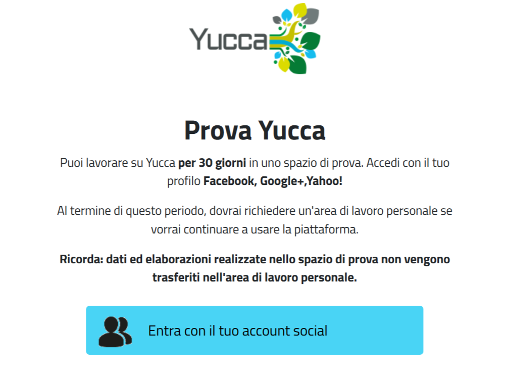
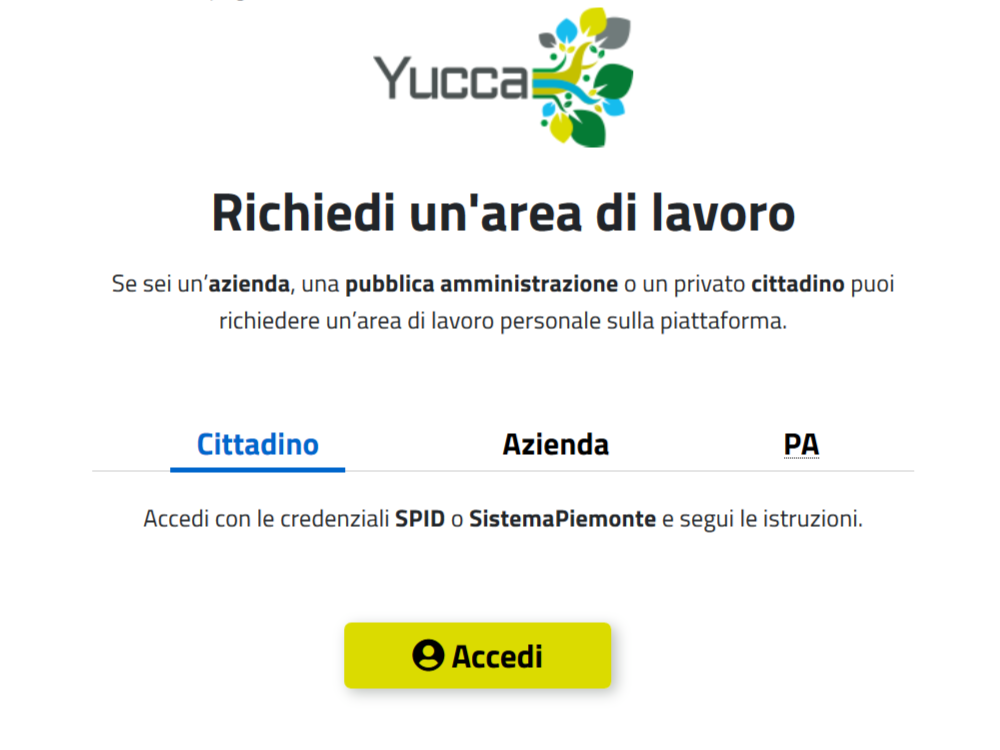

**Come accedere alla piattaforma**
**********************************

Yucca Smart Data Platform è messa a disposizione **gratuitamente** alle imprese e ai cittadini da parte di **Regione Piemonte**.

Per utilizzare le funzionalità di Yucca vi sono **due** modi:

* `Provala per 30 giorni <https://sso.smartdatanet.it/authenticationendpoint/login.do?RelayState=null&SAMLRequest=nZNPj9MwEMXvfIrI9%2BYfi2CtJqvQ1YpIyxLaLAdu3mTKWnLs4Jm0hU%2B%2FdtKyOUBVIeVkj9%2B8%2Bb3J8ubQqWAHFqXRGUvCmAWgG9NK%2FSNjj%2FXd4gO7yd8sUXSq58VAz3oNPwdACgpEsOSerYzGoQO7AbuTDTyu7zP2TNQjj6LB1fTGklAhdsJSK0hooFDS7CoSvYyE0zZW%2FgYWFERWPg0Ek7KzcpQudQuHjF1fvU3Sd0mcsuDO2AZGWxnbCoXudXmbMTdFiZVAlDt4vUAcnAQ6B5SxNE6uF3G6iN%2FXScLdF6fhVZx%2BZ0FlDZnGqI9STxgGq7kRKJFr0QFyavim%2BHzP0zDmT1MR8k91XS2qL5uaBd9OOFOP0wHWyEeA56X6Y1%2BWH3GPhu3lAuKUCMtf4T7AfhnN9Sb1tOcPTqC8rYySza%2BgUMrsVxYEOWBkBxjZdoLOt%2FQnsl1sx1Le%2B8GRQBMLNpXX%2FzoIJbcSbMZK726OI72UR%2FTH8nH3oB0jd%2BtBcKBgZbpeWIkeORxEQ%2F%2FVZWrC58or5ZCuYTuTuzyBc2UNb7y0O%2FZLuje29UsHjZustkKjj25K7a9%2B8unuX0DyU%2BDz%2FzV%2FAQ%3D%3D&commonAuthCallerPath=%252Fsamlsso&customCssPath=https%3A%2F%2Fuserportal.smartdatanet.it%2Fris%2Fauth%2Fcss%2FauthTrial.css&forceAuth=false&issuer=userportalNew&passiveAuth=false&relyingParty=userportalNew&tenantDomain=carbon.super&type=samlsso&sessionDataKey=3981df39-a567-4489-95a0-9f2b533894b0&relyingParty=userportalNew&type=samlsso&sp=userportal2&isSaaSApp=true&authenticators=SAMLSSOAuthenticator:Autenticazione%20RuparPiemonte:Autenticazione%20SistemaPiemonte:Autenticazione%20Social:Autenticazione%20Spid;BasicAuthenticator:LOCAL>`_

* `Richiedi un'area di lavoro <https://yucca.smartdatanet.it/richiedi.html>`_

