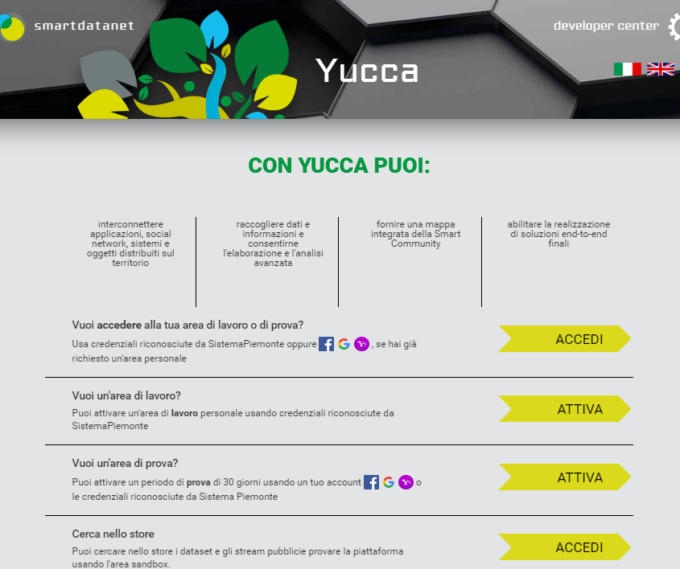
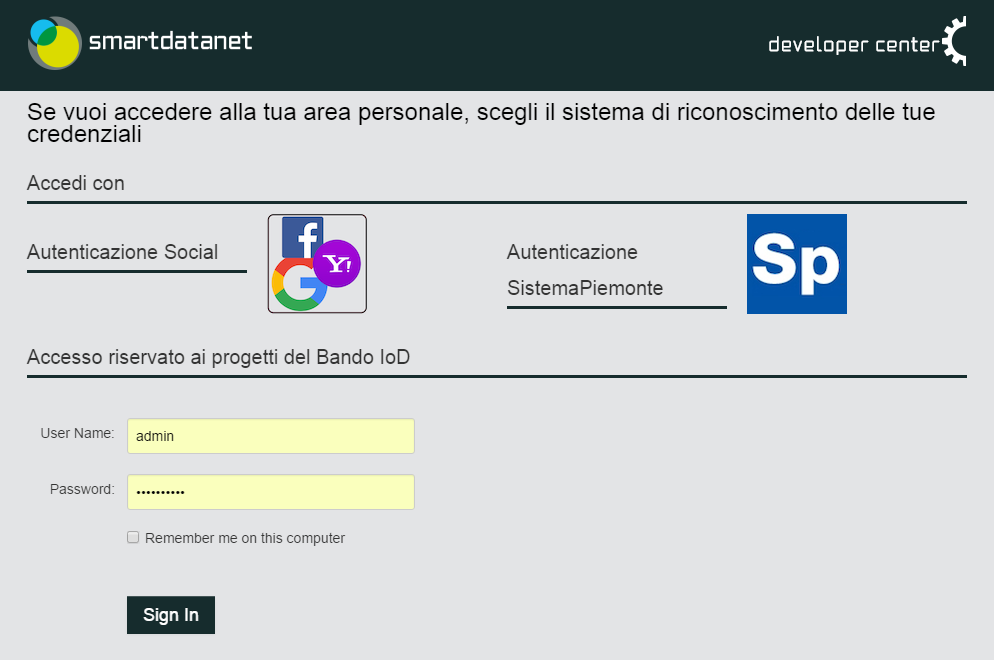
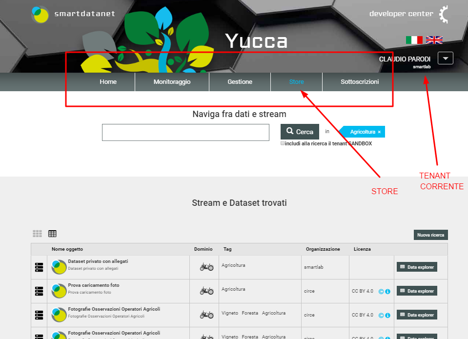

.. _user_portal:

**Accedere allo User Portal e allo store**
******************************************

**Pagina attuale** `Link <http://developer.smartdatanet.it/getting-started/getting-started-come-accedere-allo-user-portal/>`_ 

Accesso a Yucca
---------------

Per accedere allo **user portal** (interfaccia di gestione di Yucca) è necessario inserire, nel proprio browser, la seguente URL: https://userportal.smartdatanet.it.

L’accesso allo user portal può avvenire in modalità anonima oppure mediato da autenticazione. Attualmente le autenticazioni supportate sono :

- Autenticazione su Facebook, Google o Yahoo
- Autenticazione Sistema Piemonte o Carta Nazionale dei Servizi (CNS)
- Autenticazione riservata ai progetti del Bando IoD (deprecato).

Qualora si proceda in modalità anonima è possibile fruire e cercare i dataset e le api di streaming “pubbliche” oppure sperimentare su un'area di lavoro di prova condivisa detta “sandbox”.

Successivamente con il termine **tenant** si intende un'area di lavoro.

Qualora si proceda con autenticazione è possibile richiedere o lavorare su diverse tipologie di aree di lavoro a seconda del tipo di autenticazione, in particolare:

- Area di Trial: della durata di un mese,  strettamente personale e con la possibilità di inserire dati o collegari sensori visibili solo alla propria area di lavoro. Tale area è richiedibile con tutti i tipi di autenticazione
- Area Personale: durata indefinita,  strettamente personale e con la possibilità di inserire dati o collegari sensori visibili in modalità privata o pubblica. Tale area è richiedibile solo con autenticazione tramite Sistema Piemonte o CNS.
- Area Aziendale: durata indefinita,  per gruppi di progetto e con la possibilità di inserire dati o collegari sensori visibili in modalità privata o pubblica. Tale area è richiedibile tramite mail a smartdatanet@csi.it ed è possibile accedervi solo con autenticazione tramite Sistema Piemonte o CNS.

L'accesso anonimo è possibile tramite l'ultimo pulsante ACCEDI, riferito alla ricerca nello Store.

Alternativamente, nella schermata successiva,  se si dispone già delle credenziali di Sistema Piemonte o Carta Nazionale dei Servizi, selezionare “**Autenticazione SistemaPiemonte**”  altrimenti utilizzare le altre tipologie di autenticazione.

Accesso anonimo al portale
--------------------------

Ai fini di provare la piattaforma, è possibile accedere al tenant Sandbox in modalità anonima. L’accesso a questo tenant è completamente libero ed è disponibile, con funzionalità limitate, per soli scopi di test. Per accedervi fare click sul pulsante ACCEDI riferito alla ricerca nello Store, presente sulla home page del portale.

Funzionalità
------------
La piattaforma espone diverse funzionalità:

1. Monitoraggio: consente la verifica del funzionamento a runtime dei sensori e delle ricerche twitter e il corretto inserimento in piattaforma

2. Gestione: relativamente al tenant corrente (o sandbox in caso di accesso anonimo) è possibile creare, modificare, cancellare i seguenti oggetti: 

    1. Smart Object
    
    2. Stream
    
    3. Dataset

3. Store: è possibile cercare dataset e stream presenti in piattaforma, di cui si possiee il diritto di accesso ossia, tutti i pubblici, tutti i privati dei tenant (aree di lavoro) a cui si è abilitati e tutti quelli condivisi con un tenant (aree di lavoro) a cui si è abilitati.
4. Sottoscrizioni: consente la gestione di applicazioni e sottoscrizioni all'api secondo il paradigma oAuth2.

