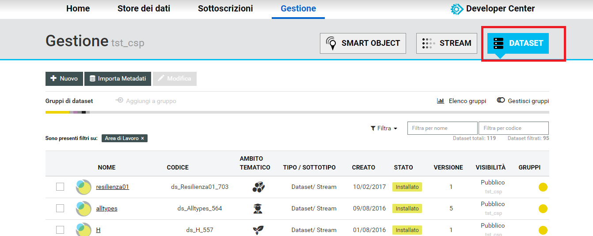
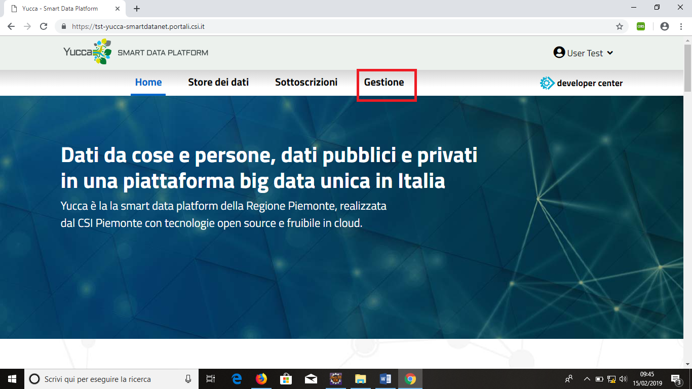
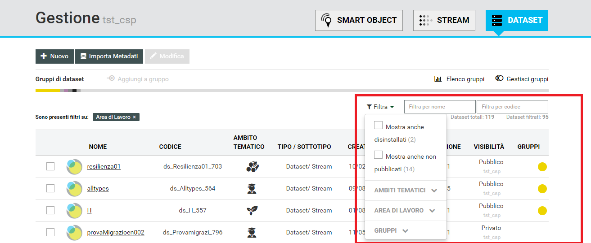
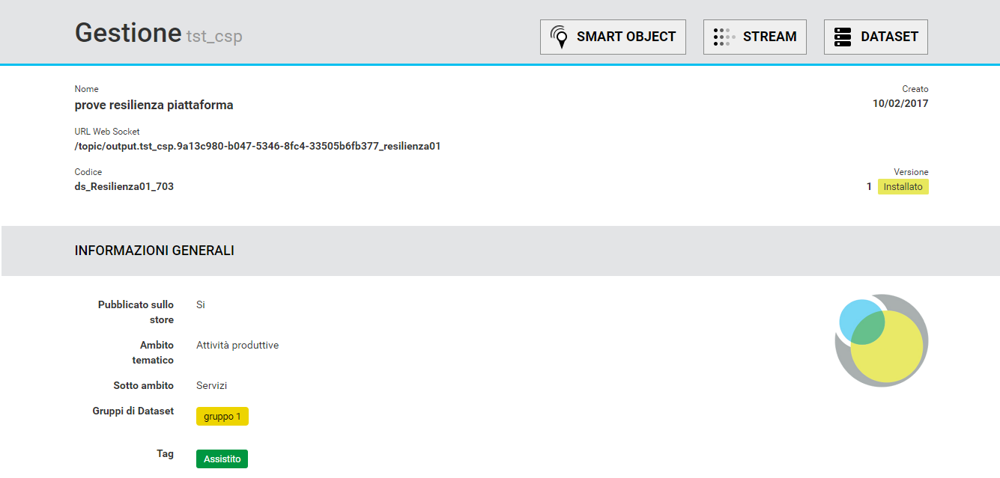
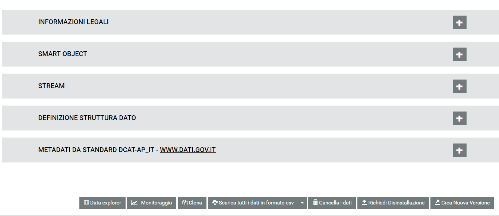
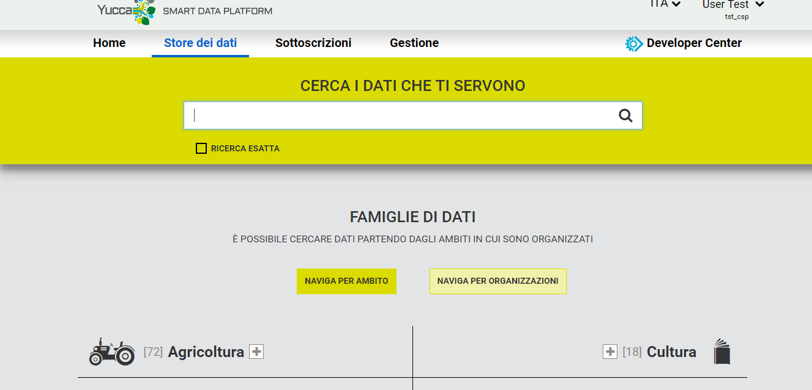
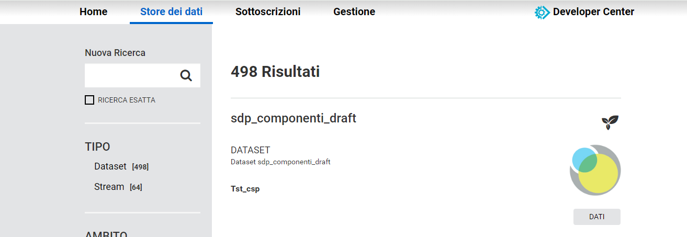
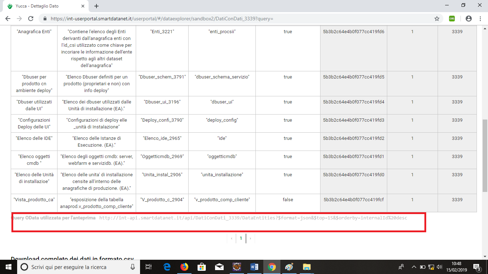
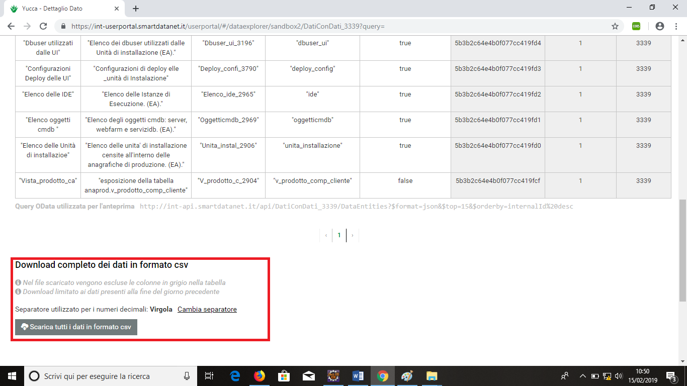

.. _accesso_api:

**Ricercare a accedere tramite API ai dataset esistenti**
*********************************************************

**Pagina attuale** `Link <http://developer.smartdatanet.it/getting-started/getting-started-discovery-e-fruizione-tramite-api-odata/>`_

Con l’attuale versione è possibile accedere ai dataset memorizzati in modo persistente sulla piattaforma attraverso il richiamo di API REST aderenti al protocollo **odata v2**. I dettagli sulla specifiche implementate sono disponibili qui. 

Attualmente sono esposti tramite API due tipologie di dataset:
    
- bulk: dataset censiti tramite interfaccia di gestione e caricati con upload di file (a breve altri protocolli per il caricamento massivo).
- stream: dataset popolati a partire dagli eventi inviati alla piattaforma tramite smart objects*
- social: dataset popolati a partire da ricerche twitter schedulate sulla piattaforma*

***Nota:** solo gli stream per cui è stato scelto di effettuare il salvataggio dati (flag salva dati) generano un dataset interrogabile via api.

Discovery e ricerca dei dataset disponibili
-------------------------------------------

La ricerca di un dataset può essere eseguita in due diverse modalità:

- tramite tab gestione
- tramite store.

lo user portal consente di eseguire una discovery **mirata sul dato** in quanto permette di impostare diversi criteri di ricerca, anche complessi e, oltre a fornire le URL di accesso ai servizi, consente pure di scaricare i dati in formato **csv (comma separated value)**.

Tramite lo store, invece, non si cercano i dataset ma le **API oData** che li espongono. Le funzioni di ricerca, inoltre, sono limitate all'utilizzo di tag e keyword semplici.

Sia utilizzando lo user portal che lo store, nell’elenco saranno visualizzati solamente i dataset per cui l’utente ha visibilità secondo la logica:

- Un dataset pubblico è visibile a tutti gli utenti
- Un dataset privato è visibile agli utenti appartenenti al tenant sotto cui è stato creato.
- (non ancora disponibile) Un dataset privato è visibile agli utenti appartenenti ai tenant a cui è stato condiviso

**Nota:** il tenant dell’utente che non ha eseguito la login è sandbox. Gli utenti autenticati risulteranno appartenti al tenant a cui sono stati associati (la richiesta di creazione tenant e inserimento in un tenant può essere fatta tramite richiesta mail a smartdatanet@csi.it oppure in autonomia nella pagina di homepage richiedendo un'area di lavoro)

**Discovery tramite User Portal**

Eseguire l'accesso allo User Portal come descritto nel relativo tutorial. Comparirà la home page della piattaforma. Cliccare sul bottone **Gestione**.

Sulla schermata che compare selezionare **Dataset**. Verrà visualizzata una tabella contenente tutti i dataset.

E' possibile filtrare i dataset per nome o codice oppure, cliccando sulla tendina **Filtra** , impostare ulteriori filtri (ambiti tematici, area di lavoro, gruppo). Dalla medesima tendina si può inoltre decidere se visualizzare anche i dataset disinstallati o non pubblicati

fare click sul **nome** del dataset per visualizzarne la schermata di dettaglio.

**Discovery tramite Store**

Eseguire l'access allo **Store** cliccando su **Store dei dati**

.. image:: img/API6.png

Inserire i criteri di ricerca.

Comparirà l'elenco dei risultati

Cliccando su **Dati** verrà visualizzata l'anteprima dei dati, sotto la qualw è riportata la **query OData** utilizzata per l'anteprima.

Da questa pagina è inoltre possibile scaricare i dati in formato CSV.

