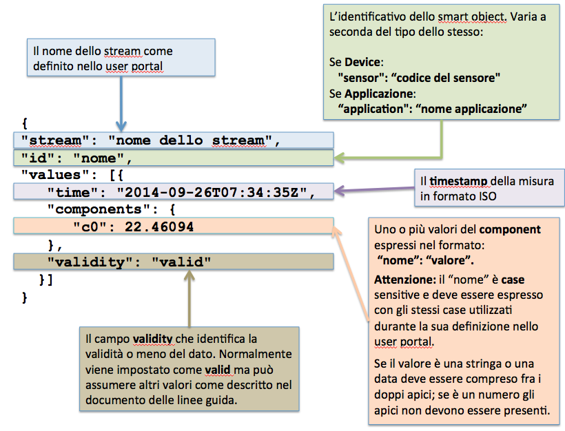
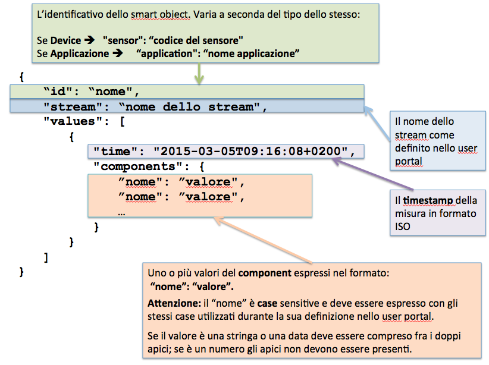

.. _inviare_dati:

**Inviare e ricevere dati da Yucca**
************************************

(ex Specifiche di interfaccia ingresso e uscita per dati alfanumerici - DOC) 

**Pagina Attuale** `Link <http://developer.smartdatanet.it/docs/specifiche-di-interfaccia-ingresso-e-uscita-per-dati-alfanumerici/>`_

**Introduzione**
================

Il presente articolo descrive le specifiche di interfaccia relative all’invio e alla fruizione di eventi alfanumerici, siano essi generati o fruiti da sensori o applicazioni.

**Endpoint della piattaforma**

La fruizione e l’invio dei flussi da e verso la piattaforma avviene tramite il nome host:
stream.smartdatanet.it 
Quindi nel proseguo dell’articolo è possibile sostituire la dicitura <server> con stream.smartdatanet.it.

Nella versione attuale è possibile accedere a tutti i flussi in uscita (in sola lettura) tramite l’utenza:

•	user: guest
•	password: Aekieh6F

Le attività di scrittura, invece, devono avvenire con l’utenza del tenant.
Per sandbox, l’utenza di alimentazione è:

•	user: sandbox
•	password: sandbox$1

**Formato dei messaggi in INPUT**

Una descrizione molto dettagliata del formato dei messaggi è descritta nel documento `Linee guida per l’integrazione <http://developer.smartdatanet.it/area-developer/linee-guida/>`_.

Per comodità si riporta la tipica struttura di un messaggio, in formato JSON,  in ingresso alla piattaforma:

 
Ad esempio, un messaggio generato da un sensore, ha una struttura simile alla seguente:
 {
   "stream": "temperature",
   "sensor": "550e8400-e29b-41d4-a716-446655440000",
   "values": [{
      "time": "2014-09-26T07:34:35Z",
      "components": {
        "c0": 22.46094
      },
      "validity": "valid"
   }]
 }

Ad esempio, un messaggio generato da un’applicazione, ha una struttura simile alla seguente:
{
  "stream": "cosumi",
  "application": "energia",
  "values": [{
      "time": "2015-03-10T11:30:00Z",
      "components": {
          "unita_misura": "kW",
          "quantita": 600,
          "id_contatore": 20,
          "valore": 300
       },
       "validity": "valid"
    }]
}

**Formato dei messaggi in OUTPUT**

Quando si sottoscrive una coda in output, si ricevono dei messaggi in formato JSON con una struttura tipica simile alla seguente:

 
Ad esempio, un possibile tracciato, per un flusso pass-trought di un sensore è il seguente:

 {
   "sensor": "550e8400-e29b-41d4-a716-446655440000",
   "stream": "temperature",
   "values": [{
      "time": "2014-09-26T07:34:35Z",
      "components": {
         "c0": 22.46094
      },
      "validity": "valid"
   }]
 }

Il formato di output dipende ovviamente dal tipo di stream (semplice o composto) e dal tipo di smart object che lo ha generato. Per la sintassi corretta dei messaggi di output dei propri stream si suggerisce di fare riferimento alla schermata di monitoraggio del singolo stream presente sullo user portal.

**Nomenclatura delle topic**

Indipendentemente dal protocollo utilizzato i messaggi inviati alla piattaforma devono essere indirizzati verso una specifica topic, censita preventivamente sul sistema tramite le modalità di pubblicazione esposte dalla piattaforma.

In maniera analoga la lettura dei messaggi in uscita dalla piattaforma può avvenire tramite la sottoscrizione del fruitore ad una specifica topic, anche essa fornita dal sistema a valle della pubblicazione del flusso in uscita.

Nativamente la piattaforma espone delle topic in uscita su cui sono pubblicati messaggi contenenti informazioni relative allo stato del sistema ed ad eventuali errori avvenuti durante il processamento dei messaggi in ingresso (per esempio in caso di validazione errata)

ATTENZIONE:  successivamente verrà utilizzato il carattere “/” per descrivere le diverse parti che compongono la topic. Tale separatore può cambiare in funzione del protocollo utilizzato.

Di seguito il formato tipico di una topic:

**<tipologia>/<tenant>/<sensore>_<flusso>[/<aux>]**

Dove:

<tipologia> può essere:

•	**input** :  topic a cui i sensori o le applicazioni inviano messaggi alla piattaforma
•	**output** : topic su cui i fruitori si  sottoscrivono per ricevere i messaggi generati dalla piattaforma

<tenant> può essere:
•	nome dell’organizzazione, azienda o ente su cui è attestato il flusso
•	platform :  per le topic riferite all’intera piattaforma

<sensor> può essere:
•	l’id del sensore (nel formato  (8-4-4-4-12) )
•	l’id dell’applicazione
•	internal per i flussi generati dalla piattaforma (per esempio ottenuti come elaborazione di altri flussi)

<flusso> identificativo del flusso.

Nota: la parte **<sensore>_<flusso>** può essere assente per i flussi di errore in uscita dalla piattaforma qualora il messaggio ricevuto non abbia consentito la corretta identificazione del flusso.

**<aux>** è un suffisso previsto per i flussi accessori generati dalla piattaforma in aggiunta al flusso in output previsto. Attualmente sono previsti:

•	errors: per gli errori relativi al flusso

Si noti come in input, le informazioni sulla coda di destinazione sono già presenti nel messaggio, sotto forma di campi (sensor/application e stream).

**Esempio**

Un’organizzazione (tenant) censita sulla piattaforma come csi potrebbe utilizzare le seguenti topic (previo censimento):

**Invio dati**
(Le informazioni del sensore e stream sono nel payload)

•	da sensore: input/csi/
•	da applicazione: input/csi/

Fruizione dati (sensore 550e8400-e29b-41d4-a716-446655440000 e flusso thermo_a):

•	con i dati raw del sensore: output/csi/550e8400-e29b-41d4-a716-446655440000_thermo_a
•	con i dati provenienti da elaborazione: output/csi/internal_thermo-calibrated
•	con gli errori relativi al flusso: output/csi/550e8400-e29b-41d4-a716-446655440000_thermo_a/errors
•	con gli errori relativi al tenant: output/csi/errors
•	con gli errori relativi alla piattaforma: output/platform/errors

**Protocolli disponibili per l’invio dei messaggi**
===================================================

**HTTP**

Per inviare messaggi sul canale http le coordinate sono le seguenti:

•	Url: http(s)://<server>/api/input/<tenant>/
•	HTTP METHOD: POST
•	Headers: 
 -	Content-type: application/json
 -	Authorization: Basic <user:pwd encoded>

**MQTT**

Per inviare messaggi sul canale mqtt le coordinate sono le seguenti:

•	Url: tcp://<server>:1883
•	Authorization: user , pwd
•	Topic: input/<tenant>/

**MQTTS**

Per inviare messaggi sul canale mqtts le coordinate sono le seguenti:

•	Url: tcp://<server>:8883
•	Authorization: user , pwd
•	Topic: input/<tenant>/

**Protocolli disponibili per la fruizione dei messaggi**
========================================================

**STOMP over WebSocket**

Per fruire messaggi sul canale websocket le coordinate sono le seguenti:

•	Url: ws(s)://<server>/ws(s)/           dove (s) è da inserire solamente nel caso di utilizzo della versione sicura WSS.
•	Destination: /topic/output.<tenant>.<sensore_flusso>[.<aux>]
•	User: user
•	Password: pwd

Per applicazioni web si consiglia l’utilizzo della libreria JS https://github.com/jmesnil/stomp-websocket

**MQTT**

Per fruire messaggi sul canale mqtt le coordinate sono le seguenti:

•	Url: tcp://<server>:1883
•	Authorization: user , pwd
•	Topic: output/<tenant>/<sensore_flusso>[/<aux>]

**MQTTS**

Per inviare messaggi sul canale mqtts le coordinate sono le seguenti:

•	Url: tcp://<server>:8883
•	Authorization: user , pwd
•	Topic: input/<tenant>/

**Certificato per l’utilizzo dei protocolli sicuri**

Il canali sicuri HTTPS e MQTTS sono implementati con SSL utilizzando un certificato digitale firmato dalla Certification Authority Actalis: il certificato di tale CA deve essere opportunamente configurato sui client in modo da poter verificare l’identità dei server di piattaforma. Per le modalità di installazione del certificato sui singoli client fare riferimento alla documentazione ufficiale degli stessi.

Scarica il certificato da `qui <https://www.actalis.it/documenti-it/actalis_server_authentication_rootca.zip>`_
