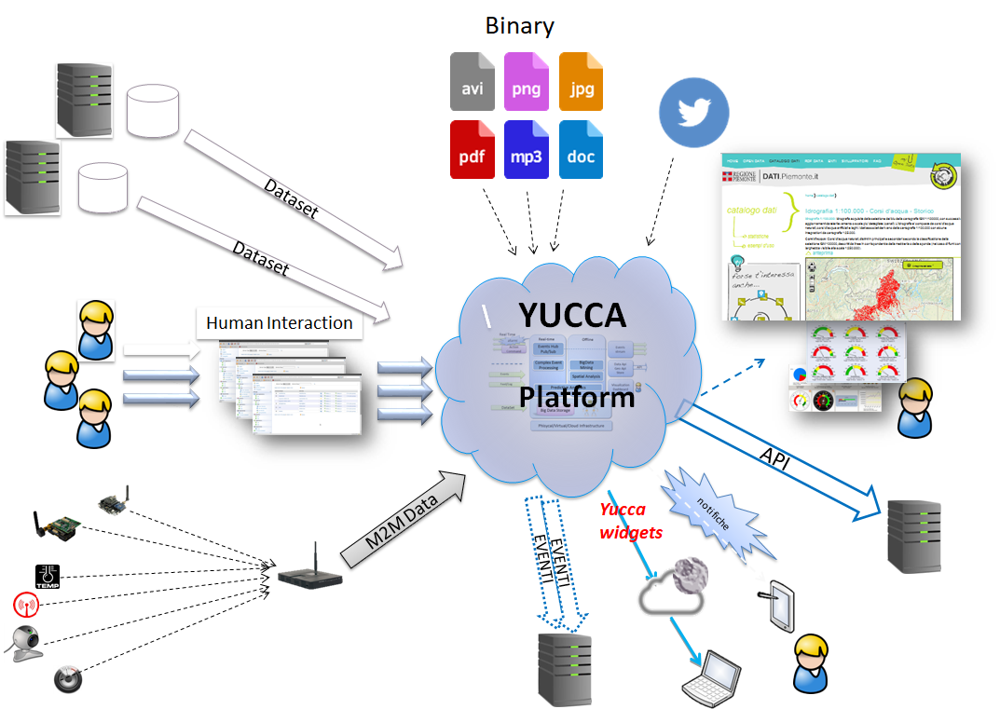

**Cosa è Yucca**
****************

**Yucca Smart Data Platform** è una piattaforma cloud aperta e precompetitiva della **Regione Piemonte**, realizzata dal **CSI Piemonte** con tecnologie open source e disponibile per soggetti privati e pubblici.

È una **piattaforma big data** messa a disposizione di cittadini e imprese che offre strumenti per sperimentare e creare **soluzioni tecnologiche innovative** legate al mondo dei dati e del digitale. 
Fornisce l’accesso tramite API a numerosi dataset di **open data** (pubblici e privati) e consente di realizzare applicazioni in ambito **Internet of Things**, **Big Data**, gestire flussi di **dati in real time**, fare **data analytics** e **molto altro**… (**metti il link alla pagina Cosa puoi fare**)

**Yucca Smart Data Platform** è la piattaforma abilitante precompetitiva a supporto dei soggetti coinvolti nel processo di innovazione che si pone l’obiettivo di essere un supporto per la creazione di un **ecosistema pubblico-privato** in cui cittadini e imprese possano utilizzare le **infrastrutture pubbliche** (piattaforma, strumenti di elaborazione, open-data) per fare business e creare **nuovi servizi**.

Scopri :ref:`cosa_puoi_fare>` con Yucca!

