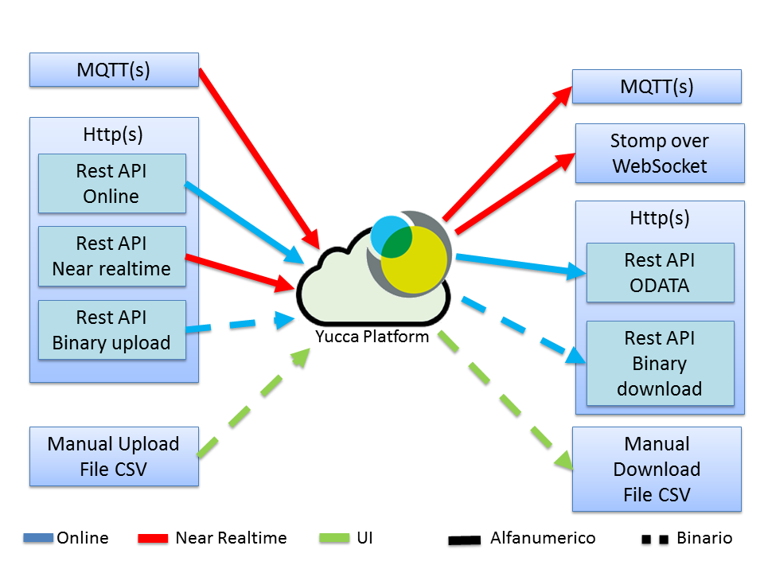

.. _protocolli_supportati:

**Protocolli Supportati da Yucca**
************************************************

**Pagina Attuale** `Link <http://developer.smartdatanet.it/docs/vista-di-insieme-dei-protocolli-iot-disponibili/>`_

Attualmente, YUCCA supporta i seguenti protocolli di Input/Output
 
In questo articolo vengono descritte solo le informazioni principali relative ai protocolli. Le indicazioni sulle architetture applicative sono solo a titolo esemplificativo: l’architettura da adottare e i protocolli da utilizzare dipendono dai requisiti dell’applicazione e la loro scelta è a carico dei gruppi di progetto delle stesse. Per il formato dei messaggi e per le URL delle code e dei servizi vedere questa pagina.

**Protocollo di streaming MQTT(s) (input/output)**
==================================================

**MQTT (Message Queuing Telemetry Transport)** è un protocollo di messaggistica leggero, studiato per dispositivi limitati in termini di risorse (cpu, memoria) che operano su reti a bassa largheza di banda e ad alta latenza. Implementa il paradigma publish/subscribe. E’ uno standard OASIS. E’ utilizzabile sia in INPUT che in OUTPUT.

**Quali tipi di dato gestisce**

Attualmente gestisce i dati delle misure (dei sensori o delle applicazioni) forniti in formato JSON.

**Per quali tipi di architettura applicativa è indicato**

il protocollo MQTT è supportato dai principali linguaggi di programmazione ed è usabile in tutti i tipi di applicazioni:

•	componenti server side scritte nei linguaggi supportati;
•	componenti client side scritte nei linguaggi supportati, comprese le Rich Internet Application in Javascript;
•	applicazioni mobile sia native che in tecnologia web;
•	sensori.

**Modalità di utilizzo**

•	In **INPUT**, l’applicazione fornitrice invia i dati ad una coda dipendente dal proprio tenant e univoca per tutti gli stream. Per un esempio è possibile vedere il seguente `tutorial <http://developer.smartdatanet.it/getting-started/getting-started-collega-i-tuoi-sensori/>`_.
•	In **OUTPUT**.

**Autenticazione**

•	In INPUT, l’autenticazione avviene utilizzando le credenziali tecniche fornite in fase di attivazione del tenant.
•	In OUTPUT, l’autenticazione avviene tramite il passaggio di un token OAuth2. Per i dati pubblici è pure possibile utilizzare l’autenticazione tramite le credenziali tecniche fornite in fase di creazione del tenant.

**Trasmissione sicura dei dati**

Il protocollo supporta la modalità sicura MQTTS. Tale modalità non è attualmente disponibile e verrà fornita in una prossima release della piattaforma.

**Quali librerie utilizzare**

Smart Data Platform non suggerisce l’utilizzo di nessuna libreria o framework MQTT ma lascia la scelta allo sviluppatore dell’applicazione. Gli esempi e i tutorial presenti sul developer portal sono stati implementati utilizzando la `libreria Paho <https://www.eclipse.org/paho/>`_ del progetto Eclipse. 

Smart Data Platfom non fornisce nessun supporto sull’utilizzo delle librerie MQTT per il quale rimanda al produttore delle stesse.

**Dove approfondire**
Per approfondimenti fare riferimento alle `specifiche <mqtt.org>`_
 del protocollo.
 
**Protocollo HTTP(s) per l’invio dei dati**
===========================================

**Http(S) (HyperText Transfer Protocol )** è il protocollo di trasferimento dati utilizzato per le normali comunicazioni sul web utilizzando un paradigma client/server. Le specifiche del protocollo sono gestite dal Word Wide Web Consortium.

**Quali tipi di dato gestisce**

Attualmente gestisce i dati delle misure (dei sensori o delle applicazioni) forniti in formato JSON. Sono in fase di realizzazione dei servizi per l’invio massivo di dati (disponibili in una prossima release).

**Per quali tipi di architettura applicativa è indicato**

Per la sua natura, il protocollo HTTP è considerato universale in quanto esistono client per qualsiasi tecnologia. E’ il protocollo suggerito in tutti quei casi in cui MQTT non è supportato correttamente. In particolare è indicato per:

•	applicazioni web ricche;
•	applicazioni mobile;
•	sensori.

**Modalità di utilizzo**

Questa modalità è utilizzabile solo in INPUT. L’applicazione fornitrice invoca un servizio HTTP POST al quale invia un messaggio JSON contenente i dati della misura. L’URL del servizio dipende dal tenant. Per un esempio è possibile vedere il seguente `tutorial <http://developer.smartdatanet.it/getting-started/getting-started-collega-i-tuoi-sensori/>`_.

**Autenticazione**

L’autenticazione avviene utilizzando le **credenziali tecniche** fornite in fase di attivazione del tenant inviate tramite **Basic Authentication**.

**Trasmissione sicura dei dati**
Il protocollo supporta la modalità sicura HTTPS. Tale modalità non è obbligatoria ma è fortemente suggerito il suo utilizzo, soprattutto per evitare attacchi l’intercettazione delle credenziali in fase di autenticazione.

**Quali librerie utilizzare**

Smart Data Platform non suggerisce l’utilizzo di nessuna libreria o framework HTTP ma lascia la scelta allo sviluppatore dell’applicazione. Smart Data Platfom non fornisce nessun supporto sull’utilizzo delle librerie HTTP per il quale rimanda al produttore delle stesse.

**Dove approfondire**

Per approfondimenti fare riferimento alle `specifiche <https://www.w3.org/Protocols/rfc2616/rfc2616.html>`_ del protocollo.
 

**Protocollo di streaming STOMP (over web socket) per la fruizione dei dati**
=============================================================================

**STOMP (Simple Text-Oriented Messaging Protocol**) è un protocollo che definisce il formato dei messaggi che transitano fra client e server. Si appoggia, come layer di trasporto, al protocollo web socket che fornisce canali di comunicazione full-dublex attraverso una singola connessione TCP/IP. Di fatto consente al server di inviare notifiche al client senza la necessità di essere invocato (modalità push).

**Quali tipi di dato gestisce**

Attualmente gestisce i dati delle misure (dei sensori o delle applicazioni) forniti in formato JSON.

**Per quali tipi di architettura applicativa è indicato**

Essendo nato per il mondo web è particolarmente è indicato per:

•	applicazioni web ricche scritte in Javascript.
•	applicazioni mobile web e ibride scritte in javascript.

Esistendo implementazioni websocket anche per linguaggi serverside (es. java), non si esclude la possibilità di utilizzarlo anche server side.

**Modalità di utilizzo**

Questa modalità è utilizzabile solo in OUTPUT. L’applicazione fruitrice si sottoscrive ad una coda dipendente dallo stream di cui si vogliono leggere i dati. Per un esempio è possibile vedere il seguente tutorial.

**Autenticazione**

L’autenticazione avviene tramite il passaggio di un token OAuth2. Per i dati pubblici è pure possibile utilizzare l’autenticazione tramite le credenziali tecniche fornite in fase di creazione del tenant.

**Trasmissione sicura dei dati**

Attualmente non è supportata. In futuro sarà possibile utilizzare la cifratura via SSL.

**Quali librerie utilizzare**

Smart Data Platform non suggerisce l’utilizzo di nessuna libreria o framework STOMP ma lascia la scelta allo sviluppatore dell’applicazione. Negli esempi è stata utilizzata la `libreria ufficiale <http://jmesnil.net/stomp-websocket/doc/>`_ rilasciata da chi ha redatto le specifiche del protocollo. Smart Data Platfom non fornisce nessun supporto sull’utilizzo delle librerie utilizzate per il quale rimanda al produttore delle stesse.
Dove approfondire
Per approfondimenti fare riferimento alle `specifiche <http://jmesnil.net/stomp-websocket/doc/>`_ del protocollo.

**REST oData Service per la fruizione dei dati**
================================================

**ODATA (Open Data)** è un protocollo, rilasciato da Microsoft, che definisce le modalità di esposizione e richiamo di servizi REST. Si appoggia al protocollo HTTP del quale eredita le modalità di accesso e fruizione.

**Quali tipi di dato gestisce**

Attualmente gestisce i dati, delle applicazioni e dei sensori che sono stati memorizzati in modo permanente sulla piattaforma.

**Per quali tipi di architettura applicativa è indicato**

Essendo basato sul protocollo HTTP è utilizzbile con tutte le tipologie di architetture applicative.

**Modalità di utilizzo**

Questa modalità è utilizzabile solo in OUTPUT. L’applicazione invoca, via HTTP(S) i servizi. Per un tutorial sull’utilizzo di oData vedere questo `link <http://developer.smartdatanet.it/docs/specifiche-per-laccesso-ai-servizi-di-esposizione-dei-dati/>`_.

**Autenticazione**

L’autenticazione avviene tramite il passaggio di un token OAuth2. Per i dati pubblici è pure possibile utilizzare l’autenticazione tramite le credenziali tecniche fornite in fase di creazione del tenant.

**Trasmissione sicura dei dati**

Il protocollo supporta la modalità sicura HTTPS. Tale modalità non è obbligatoria ma è fortemente suggerito il suo utilizzo, soprattutto per evitare attacchi l’intercettazione delle credenziali in fase di autenticazione.

**Quali librerie utilizzare**

Smart Data Platform non suggerisce l’utilizzo di nessuna libreria o framework HTTP, REST o oData ma lascia la scelta allo sviluppatore dell’applicazione. Smart Data Platfom non fornisce nessun supporto sull’utilizzo delle librerie utilizzate per il quale rimanda al produttore delle stesse.

**Dove approfondire**
Per approfondimenti fare riferimento alle `specifiche <https://www.odata.org/>`_
 del protocollo.

**Download dei file**
=====================

Si tratta della funzionalità standard di download, via HTTP, utilizzata dai siti e dalle applicazioni web.

**Quali tipi di dato gestisce**

Attualmente gestisce i dati bulk caricati, sulla piattaforma, dalle applicazioni.

**Per quali tipi di architettura applicativa è indicato**

E’ un download di file. E’ utile per fare l’import massivo dei dati all’interno dei propri sistemi informativi.

**Modalità di utilizzo**

Si esegue il download del file dallo `User Portal <https://userportal.smartdatanet.it/userportal/#/home>`_.

**Autenticazione**

L’autenticazione avviene facendo login sullo `User Portal <https://userportal.smartdatanet.it/userportal/#/home>`_.

**Trasmissione sicura dei dati**

Il download dei file avviene tramite il protocollo HTTPS.

**Quali librerie utilizzare**

L’operazione è manuale.

**Dove approfondire**

Vedi questo `tutorial <http://developer.smartdatanet.it/getting-started/getting-started-discovery-e-fruizione-tramite-api-odata/>`_.
